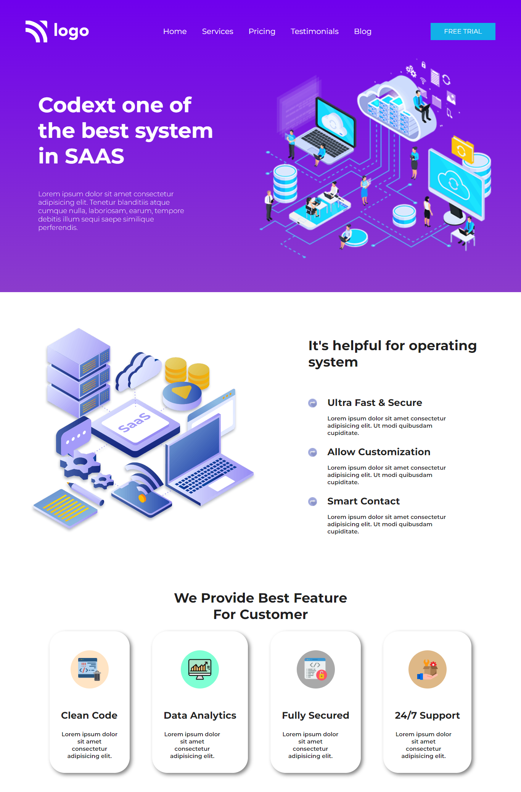

# Project-13
Web Security Home Page

Creating a webpage for a Web Security Firm

Hands-on Experience:
- Flexbox - 'Extensive Usage'
  - Display type
  - Justify content
  - Flex direction
- Pseudo selectors
  - Hover
- Transitions
  - Delay
  - Ease-in, Ease-out
- SVG files Handling
  - Working on Figma
- Creating cards
  - Box shadow
- Background Styling
  - Linear gradient
  

